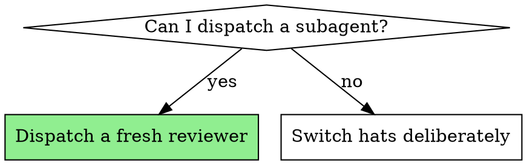

# Adversarial Self-Review

## Overview

The maker of a thing is the worst judge of it. You know what you meant, so you
read the artifact and see your intention rather than what is actually there.
This skill puts something between the work and your confidence.

**Core principle:** The reviewer must judge the *work product*, not your
reasoning about it. The less the reviewer knows about why you did it, the better
the review.

**Violating the letter of this rule is violating the spirit of this rule.**

## The Iron Law

```
THE REVIEWER TESTS CLAIMS AGAINST THE WORK.
A CLAIM YOU EXPLAIN IS STILL A CLAIM.
```

## Choose the Strongest Reviewer Available



**Dispatch a subagent when your harness supports it.** A fresh context is the
whole advantage: it cannot be persuaded by reasoning it never saw. Use
[reviewer-prompt.md](reviewer-prompt.md).

**If your harness has no subagent capability,** do not fabricate a dispatch and
do not skip the step. Switch hats in-session, using the discipline below. Say in
your report which mode you used — an in-session review is weaker and the asker
is entitled to know which one they got.

## What the Reviewer Receives

Exactly four things, and nothing else:

1. **The reconstructed intent** — from `reconstructing-intent`, quotes included.
2. **The evidence ledger** — from `building-evidence-ledgers`, presented as
   *unverified claims*.
3. **The work itself** — the diff, the file, the output, the artifact. Say where
   to look and what the before/after states are.
4. **The instruction to distrust the ledger.**

What the reviewer must **not** receive: your reasoning, your tradeoff notes,
your explanation of why a shortcut was fine. Those are the exact inputs that
turn a review into a rubber stamp.

## The In-Session Hat Switch

When you cannot dispatch, the risk is that "reviewing" becomes re-reading your
own work approvingly. These rules make it a real pass:

1. **Announce the switch.** "Switching to reviewer. I am now trying to find
   where this work fails to match the ask." Naming the role change is what
   stops the drift back into defending.
2. **Invert the burden of proof.** Every ledger row is wrong until its evidence
   proves otherwise. Not "is there a reason to doubt this?" but "what would
   convince a stranger?"
3. **Go to the artifact, every row.** Open the file, re-run the command, read
   the output. Reviewing the ledger against the ledger proves nothing.
4. **Look hardest at the rows you are most sure about.** Certainty is where you
   stopped checking.
5. **Try to break the strongest row.** If you cannot find a single problem
   anywhere, you are not reviewing.
6. **Write verdicts before conclusions.** Per-row verdicts first; the overall
   gate is derived from them, never chosen first and justified backwards.

## Verdicts

The reviewer returns one per step:

| Verdict | Test |
|---|---|
| **Matches** | Does what was asked, and the evidence actually shows it |
| **Diverged** | Right area, wrong shape — wrong approach, values, or format, or scope nobody asked for |
| **Missing** | Something asked for was skipped, or claimed but not done |
| **Unverifiable** | The evidence does not prove the claim |

Then a single gate: **APPROVED** or **NEEDS REWORK**. Any Diverged or Missing
makes it NEEDS REWORK. There is no partial credit and no "approved with notes."

## Things That Never Change a Verdict

Named explicitly because each one has talked a reviewer out of a finding:

- **The maker's rationale.** "Kept it simple", "per YAGNI", "seemed useful",
  "the alternative was slower." The review grades the artifact, not the story.
- **Effort spent.** A hard-won wrong thing is still wrong.
- **Quality of the extra.** An unrequested addition being *good* does not make
  it requested.
- **Lateness.** Finding a problem at the end is not a reason to downgrade it.
- **Recoverability.** "They can just tell me" is not a pass.
- **Everything else being fine.** Verdicts are per-step; a good run does not
  absorb one bad step.

## Common Mistakes

| Mistake | Why it fails |
|---|---|
| Sending the reviewer your reasoning | You have handed it the argument for approving. |
| Sending the ledger without the work | It can only re-read your claims. |
| Reviewing before the ledger exists | Nothing concrete to test; you get impressions. |
| Letting the reviewer crawl the whole project | It burns context and returns generic notes. Point it at named risks. |
| Accepting "looks good overall" | That is not a per-step verdict. Send it back. |
| Running the review, then arguing with it | See `closing-the-review-loop`. Fix the work. |
| Skipping the review because the task was small | Small tasks are where unchecked drift ships. |

## Red Flags - STOP

- You are writing the review prompt to make approval likely
- You caught yourself explaining a row instead of checking it
- Every row came back Matches on the first pass
- You are deciding the gate first and picking verdicts to fit
- You want to skip this because you are confident

**Next:** any Diverged, Missing, or Unverifiable goes to
`closing-the-review-loop`.
