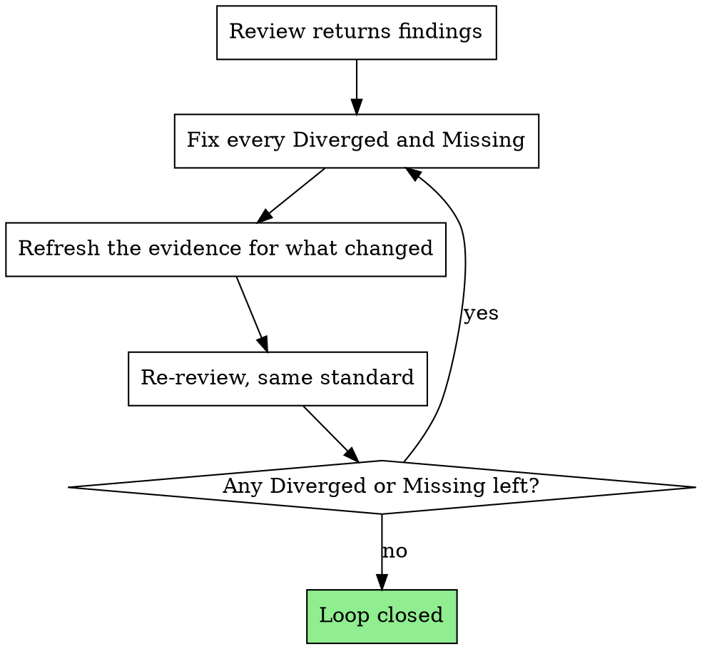

# Closing the Review Loop

## Overview

A review that produces findings has done its job. The failure mode is what
happens next: the findings get discussed, reframed, contextualized, and
gradually reclassified as acceptable, and the work ships unchanged with a review
attached to it. That is worse than no review, because now there is a paper trail
suggesting it was checked.

**Core principle:** Findings are closed by changing the work, not by changing
your mind about the finding.

**Violating the letter of this rule is violating the spirit of this rule.**

## The Iron Law

```
FIX THE WORK, NOT THE VERDICT.
A FINDING IS CLOSED WHEN A FRESH REVIEW NO LONGER RAISES IT.
```

## The Loop



### 1. Fix, by verdict

| Verdict | What closing it means |
|---|---|
| **Missing** | Do the thing that was asked. Not a note explaining why it wasn't done. |
| **Diverged (wrong shape)** | Redo it in the shape that was asked, even if yours works. |
| **Diverged (extra)** | Remove it, or get explicit agreement to keep it. Silence is not agreement. |
| **Unverifiable** | Get the evidence. If it genuinely cannot be gotten, see *Legitimate exits* below. |

### 2. Refresh evidence for everything you touched

Fixing one row can break another. Any row whose subject you touched needs new
evidence — the old cell is now stale, even if the row is unrelated to the
finding. Re-run, re-read, re-check.

### 3. Re-review at the same standard

Send the whole thing back through `adversarial-self-review`: full intent, full
ledger, the work as it now stands. Not a diff of your fixes — a fix can be
correct in isolation and wrong against the ask.

**Same reviewer setup, same prompt, same rigor.** If you dispatched a subagent
the first time, dispatch one now. Re-reviewing more gently than you reviewed is
how a loop terminates without converging.

### 4. Repeat until nothing blocks

The loop ends when a full review returns no Diverged and no Missing. It does not
end because you have been round it twice, or because the remaining item is
small, or because you are tired.

## The Only Legitimate Exits

There are exactly three ways out of this loop. Anything else is defeat dressed
as completion.

**1. Clean review.** No Diverged, no Missing. Go to `reporting-honestly`.

**2. Genuinely blocked.** You cannot fix it because the capability, access,
information, or decision is not yours to make. Then: stop, do not report the
work as done, and tell the asker *what* is unresolved, *why* you cannot resolve
it, and *what you need* from them. A blocked finding surfaced immediately is a
good outcome. A blocked finding buried in a completion summary is not.

**3. The asker overrules it.** You put the finding to them plainly, in full, and
they said ship it anyway. Their call — record it as their call, not as a pass.

Notice what is absent: "it's minor," "it's out of scope now," "I'll note it as
follow-up," "the rest is fine." None of those close a finding.

### A review still running is not an exit

If you dispatched a reviewer and it has not returned, the loop is **open**. You
have three options, and reporting completion is not among them:

1. **Wait for it.** This is almost always right. You started the check because
   the answer mattered.
2. **Report the work as not yet cleared**, saying plainly that a review is
   outstanding and what you will do with the result.
3. **Abandon the review explicitly** and say you did, so nobody believes the work
   was checked when it was not.

**Do not promise to deliver a result you have no channel for.** "I'll ping you
when it comes back" requires a way to ping them. If your turn ends when you
reply, there is no later — the result will be lost, and the promise is what
stopped the reader from chasing it.

An outstanding review is the one case where the work may genuinely be fine and
the report is still wrong: you told someone it was checked before you knew.

## Anti-Negotiation

Every one of these has been used to close a finding without touching the work.
When you catch yourself in one, stop and go fix the thing.

| Move | What it actually is |
|---|---|
| "The reviewer misunderstood the context" | You are supplying the rationale you withheld on purpose. If the artifact needs your explanation to look right, it doesn't look right. |
| "That's a nit / minor / cosmetic" | Reclassifying, not fixing. The reviewer already assigned severity. |
| "I'll add it as a follow-up item" | A follow-up is a plan to do it later, not a reason to say done now. |
| "It's out of scope" | It was in scope enough to be built. It is in scope enough to be fixed. |
| "Technically it still satisfies the requirement" | If you need "technically", it doesn't. |
| "The extra is genuinely better than what they asked for" | Then say so and ask. Deciding for them is the divergence. |
| "Everything else passed" | Verdicts are per-step. Other steps passing is not evidence about this one. |
| "Re-running the review will just cost more time" | The cost of a wrong "done" lands on someone else. |
| Re-dispatching with softer framing | Shopping for a verdict. Not a second review. |
| "I already spent hours on this approach" | Sunk cost. The work is judged by what it is. |

## Red Flags - STOP

- Writing a rebuttal to a finding instead of a fix
- Re-reading a finding hoping it says something different
- Re-reviewing only the parts you changed
- Softening the re-review prompt
- Deciding the loop has "converged enough"
- Moving a finding into a "known limitations" list you invented just now
- Feeling relief that a finding is *only* Unverifiable

## When the Loop Won't Converge

Two rounds with no progress usually means the fixes are aimed at the wrong
thing. Go back to `reconstructing-intent` and re-derive what was asked. Most
non-converging loops are a misread of the ask being patched at the symptom
level, over and over.

If the reconstruction was right and it still won't converge, that is exit 2.
Stop and say so.

**Next:** once the loop closes, `reporting-honestly`.
