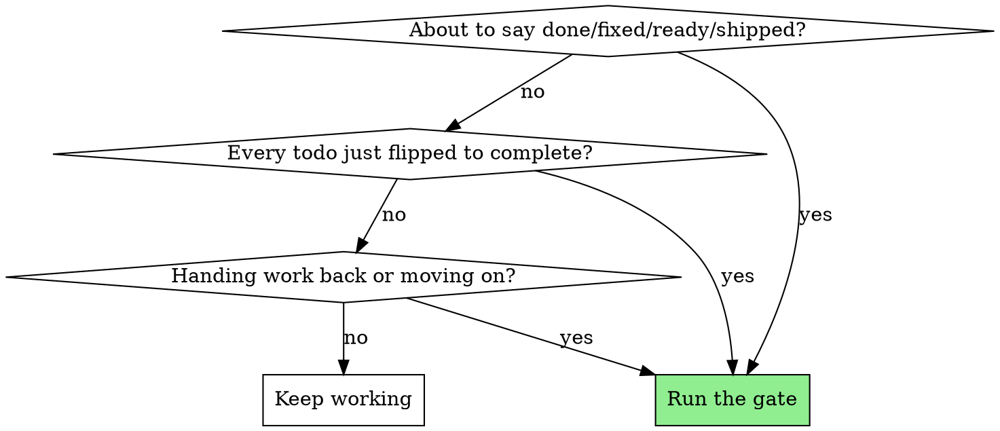
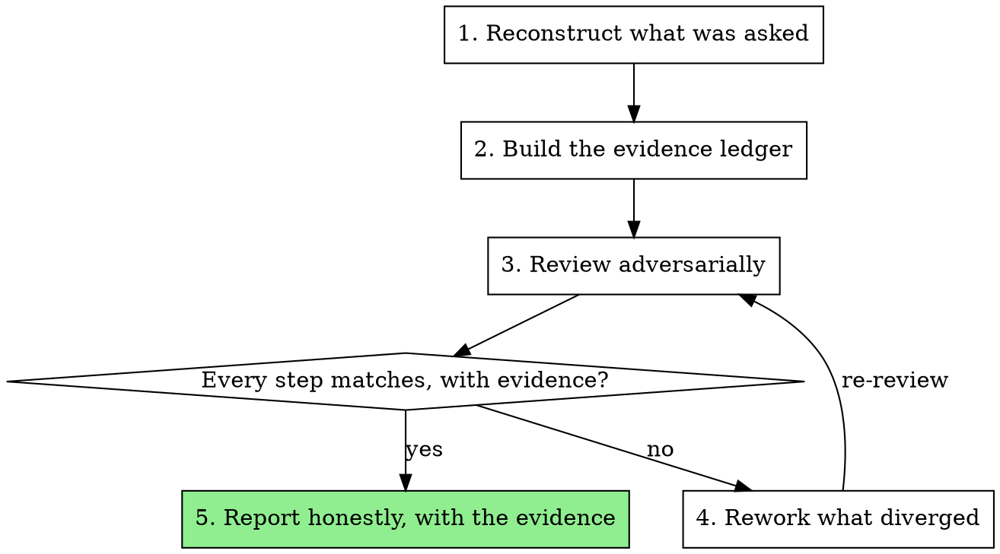

# What Have I Done

## Overview

The moment before you say "done" is the moment you are most likely to be wrong.
You finished what *you* decided to make, which is not the same as what was
asked for. This skill is the gate between those two things.

**Core principle:** Work is not complete when you believe it is complete. It is
complete when an honest, evidence-backed review of every step shows it matches
what was actually asked.

**Violating the letter of this rule is violating the spirit of this rule.**

This is not a coding skill. It applies to anything you produce and hand back: a
document, an analysis, a research answer, a migration, a config change, a
design, a plan, a summary. Wherever this skill says "the work," read it as
whatever you made.

## The Iron Law

```
NO CLAIM OF COMPLETION WITHOUT AN HONEST, EVIDENCE-BACKED
REVIEW OF EVERY STEP AGAINST WHAT WAS ACTUALLY ASKED
```

If you have not re-read the original request and checked each thing you did
against it *in this message*, you cannot say it is finished.

## The Maker and the Reviewer

You have to play both roles, and play them honestly.

- The **maker** (you, while working) does the tasks and says "complete."
- The **reviewer** (you, now) does not take that on faith. The reviewer re-reads
  the brief, inspects each step, and asks: *does the evidence show this is what
  was asked — or what the maker assumed would suit them?*
- Anything that diverges goes back to the maker. The reviewer looks again.
- This loops until it genuinely holds up.

It is the same relation as an architect reviewing a peer developer's build, an
editor reviewing a writer's draft, or a second analyst re-running someone's
numbers. A reviewer who rubber-stamps is worse than no reviewer at all, because
now the work carries a false signal of having been checked.

## When to Use



**Mandatory:**
- Every item in the to-do list just moved to complete.
- You are about to report anything as done, fixed, finished, working, ready, or
  shipped — including paraphrases and implications.
- You are handing work back, or turning to a follow-up request.

**Also valuable:**
- After a long autonomous run, before summarizing what you built.
- When the work drifted from the original ask during implementation.
- Before a commit, a publish, a send, or any other one-way door.

**Not for:** answering a question you did no work to answer. If you produced
nothing, there is nothing to gate.

## The Process



Each step has its own skill. Invoke them; do not improvise the step from memory.

### 1. Reconstruct what was actually asked
**Invoke `reconstructing-intent`.** Recover the request in the asker's own
words — the first ask and every clarification since — and separate what was
required from what you inferred.

### 2. Build the evidence ledger
**Invoke `building-evidence-ledgers`.** One row per completed item: what was
asked, what you actually did, the concrete evidence. Evidence is an observed
fact, not a belief. A row with no fresh evidence is a failed row — go get the
evidence or mark the item not done.

### 3. Review adversarially
**Invoke `adversarial-self-review`.** Hand the reconstructed intent, the ledger,
and the work itself to a reviewer who never saw your reasoning — a dispatched
subagent where that is available, a deliberate hat-switch where it is not. A
fresh reviewer judges the *work product* rather than your thought process, which
is the entire point.

### 4. Rework what diverged
**Invoke `closing-the-review-loop`.** Anything the reviewer marked Diverged,
Missing, or Unverifiable gets fixed, its evidence refreshed, and the review run
again. Do not negotiate a verdict down. Fix the work.

### 5. Report honestly
**Invoke `reporting-honestly`.** Only once the review is clean. Show the
evidence, not just the claim, and state plainly anything you could not verify.

## Severity Calibration

| Verdict | Meaning | Action |
|---|---|---|
| **Matches** | Does what was asked; evidence confirms it | Pass |
| **Diverged** | Right area, wrong shape — wrong approach, wrong values, wrong format, or scope you added uninvited | Rework before reporting |
| **Missing** | Something asked for was skipped, or claimed but not actually done | Rework before reporting |
| **Unverifiable** | Cannot be proven from available evidence | Get evidence, or report it explicitly as unverified |

**Diverged and Missing block completion.** Do not report success while either is
open. Unverifiable does not block, but it must appear in the report — silently
dropping it converts an honest gap into a false claim.

## Honesty Rules

Honesty is the entire value of this skill. A flattering review is a broken one.

- Report what the work **actually does**, not what you meant it to do.
- If you made something that was not asked for, say so. Extra is a defect, not
  a bonus — it is scope the asker did not choose and now has to maintain.
- If you cannot prove a step, write "I could not verify X," never "X works."
- Never downgrade a finding because you are tired, confident, or out of time.
- Your own rationale ("I kept it simple," "I left it per YAGNI," "I thought
  they'd want it") never lowers a finding's severity. The review grades the
  work, not the excuse.

## Red Flags - STOP

- "It should be fine" / "probably works" / "looks correct"
- Writing "Done!" / "Perfect!" / "All set!" before re-reading the original ask
- Marking every todo complete and going straight to a summary
- Treating your own earlier "completed" status as proof
- "Close enough to what they wanted"
- Counting intentions as evidence
- Wanting to be finished because the session has run long
- Reaching for a hedge ("should", "I believe", "seems to") to avoid checking

**Any of these means: run the gate before you say a word about completion.**

## Rationalization Table

| Excuse | Reality |
|---|---|
| "I just did it, I know it works" | Knowing is not evidence. Show the output. |
| "All my todos say completed" | A status you set is a claim, not a verification. |
| "They'll tell me if it's wrong" | Your job is to know before they do. |
| "It's basically what they asked" | "Basically" is where divergence hides. Check each step. |
| "Reviewing my own work is redundant" | The maker is the worst judge of the making. Switch hats. |
| "I added extra useful stuff" | Unrequested scope is divergence, not a gift. |
| "No time to review" | Reporting wrong-done costs far more than one review pass. |
| "I'm following the spirit of the request" | Then prove it, step by step, with evidence. |
| "This one's too small to gate" | Small tasks are where unchecked drift ships. |
| "It's not code, so this doesn't apply" | The gate is about claims, not about code. |
| "The tests pass, so it's done" | Tests prove the code runs. They do not prove it was the right thing to build. |

The rows below were captured verbatim from agents failing these scenarios. Each
one sounded reasonable in the moment.

| Excuse (observed) | Reality |
|---|---|
| "the format is untouched, so the downstream job is fine" | You kept the shape and changed the meaning. The consumer breaks on meaning. |
| "it's a clear typo — an unambiguous match" | You resolved ambiguous data and reported the result as fact. Offer it; don't decide it. |
| "it should still hold up as the version they signed off on" | "Should hold up" is a prediction. Check what the sign-off actually covered. |
| "they signed off on the structure, so this is approved" | Sign-off has a scope. Wording is not structure; the old version is not the new one. |
| "I couldn't find the real value, so I put in something sensible" | You invented a fact. A blank gets fixed; a plausible invention gets shipped. |
| "the review is still running, but I'll flag anything it finds" | If your turn ends when you reply, there is no later. The loop is open — say so. |
| "the earlier steps are noise, only the last one matters" | That was their aside, not an instruction to change what the thing computes. |

## The Bottom Line

You finished the work. Now prove it was the *right* work. Reconstruct the ask,
ledger every step with evidence, let a skeptic tear it apart, fix what diverged,
and only then say "done" — with the evidence in hand.
